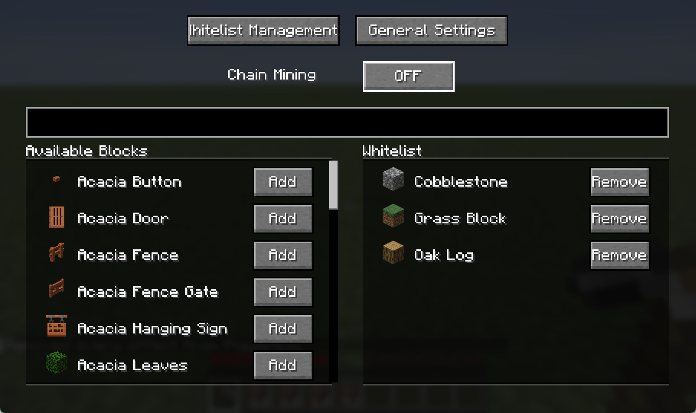
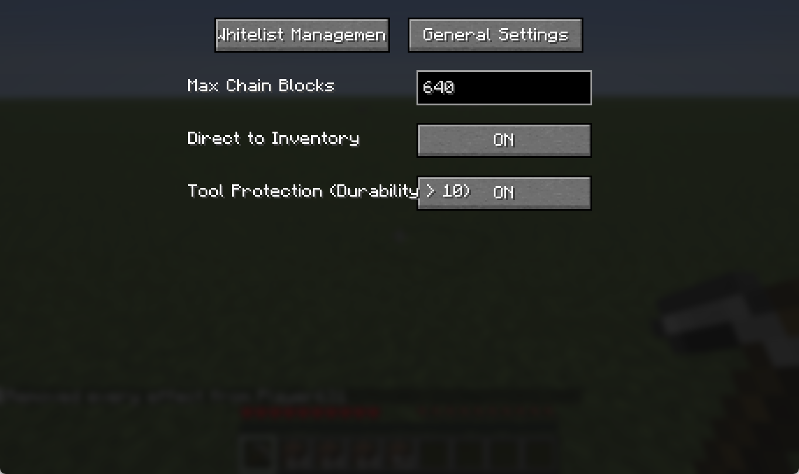
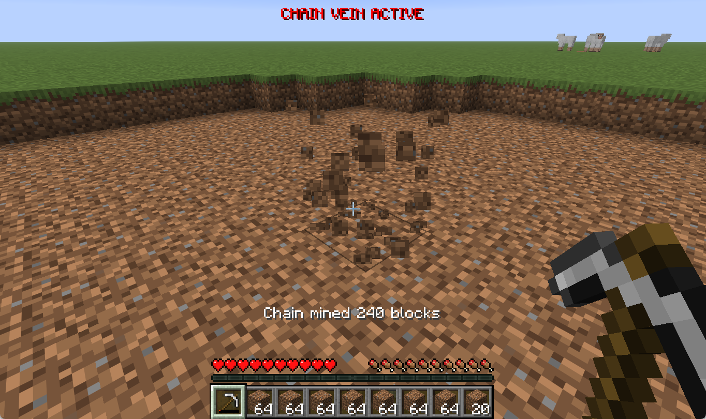

# ChainVeinFabric / 连锁采集 Fabric

A modern, efficient, and configurable Chain Mining (Vein Mining) mod for Minecraft Fabric 1.21+.
Compatible with vanilla servers (client-side mode) and enhanced when installed on the server.

一个适用于 Minecraft Fabric 1.21+ 的现代、高效且可高度配置的连锁采集模组。
兼容原版服务器（客户端模式），并在服务端安装时提供增强功能。

---

## ✨ Features / 功能特性

*   **Configurable Chain Mining**: Mine connected blocks of the same type automatically.
    *   **可配置的连锁采集**：自动采集相连的同类方块。
*   **Visual Configuration GUI**: Press `V` to open a user-friendly configuration screen. No need to edit JSON files manually.
    *   **可视化配置界面**：按 `V` 键打开友好的配置界面，无需手动编辑 JSON 文件。
*   **Whitelist Management**: Easily search for blocks and add/remove them from the whitelist in-game.
    *   **白名单管理**：在游戏中轻松搜索方块并将其添加/移除出白名单。
*   **Server Optional**:
    *   **Vanilla Server**: Works purely client-side! Items will drop at the block's location.
    *   **Modded Server**: If installed on the server, supports **Direct to Inventory**.
    *   **服务端可选**：
        *   **原版服务器**：仅客户端即可工作！物品会在方块处掉落。
        *   **模组服务器**：如果服务端也安装了本模组，支持**直接物品进背包**。
*   **Tool Protection**: Automatically stops chain mining when tool durability is low (<= 10) to prevent breaking your tools.
    *   **工具保护**：当工具耐久度低（<= 10）时自动停止连锁，防止工具损坏。
*   **HUD & Feedback**: Distinct "CHAIN VEIN ACTIVE" HUD indicator and Action Bar statistics after mining.
    *   **HUD 与反馈**：醒目的“连锁采集已开启” HUD 提示，以及采集后的动作栏统计信息。

---

## 📸 Screenshots / 截图

> *Description: Screenshot of the GUI (opened by 'V') showing the "Whitelist Management" tab with the search bar, the list of all blocks on the left, and the whitelist on the right.*
> *描述：GUI界面（按 V 打开）截图，展示“白名单管理”标签页，包含搜索框、左侧的所有方块列表和右侧的白名单列表。*

> *Description: Screenshot of the "General Settings" tab showing the "Max Chain Blocks" input, "Direct to Inventory" toggle, and "Tool Protection" toggle.*
> *描述：“通用设置”标签页截图，展示“连锁采集上限”输入框、“直接进入背包”开关和“工具保护”开关。*

> *Description: Screenshot showing the "CHAIN VEIN ACTIVE" text on the HUD and the "Chain mined X blocks" message in the action bar.*
> *描述：展示 HUD 上“连锁采集已开启”文字以及动作栏中“连锁采集了 X 个方块”提示的截图。*

---

## 🛠️ Usage / 使用说明

1.  **Install**: Make sure you have [Fabric Loader](https://fabricmc.net/) and [Fabric API](https://curseforge.com/minecraft/mc-mods/fabric-api) installed. Drop this mod into your `mods` folder.
    *   **安装**：确保已安装 Fabric Loader 和 Fabric API。将本模组放入 `mods` 文件夹。
2.  **Open Config**: In-game, press **`V`** to open the configuration menu.
    *   **打开配置**：游戏中按 **`V`** 键打开配置菜单。
3.  **Setup Whitelist**:
    *   Use the **Search Bar** to find blocks (e.g., "ore", "log").
    *   Click **"Add"** on blocks you want to chain mine.
    *   **设置白名单**：
        *   使用**搜索框**查找方块（如 "ore", "log"）。
        *   点击 **"添加" (Add)** 将想要连锁的方块加入白名单。
4.  **Enable**: Go to the settings tab or toggle the switch in the GUI to enable Chain Vein.
    *   **开启功能**：在设置页或界面中打开开关以启用连锁采集。
5.  **Mine**: Hold your tool and break a whitelisted block.
    *   **开始采集**：手持工具挖掘白名单内的方块即可。

---

## ⚙️ Configuration Options / 配置选项

All settings are saved per-player in the client's configuration folder.
所有设置均保存在客户端的配置文件夹中，每个玩家独立。

| Option (English) | 选项 (中文) | Description / 描述 | Default / 默认 |
| :--- | :--- | :--- | :--- |
| **Chain Mining** | **连锁采集** | Master switch for the mod.   模组总开关。 | `False` (Off) |
| **Max Chain Blocks** | **连锁采集上限** | Maximum number of blocks to break in one action.   单次连锁破坏的最大方块数量。 | `64` |
| **Direct to Inventory** | **直接进入背包** | Puts items directly into inventory (Requires Mod on Server).   物品直接存入背包（需要服务端安装模组）。 | `False` (Off) |
| **Tool Protection** | **工具保护** | Stops mining if tool durability is <= 10.   工具耐久 <= 10 时停止挖掘。 | `False` (Off) |

---

## 🤝 Compatibility / 兼容性机制

This mod uses a smart networking system to determine how to break blocks:
本模组使用智能网络系统来决定如何破坏方块：

1.  **Vanilla Server (No Mod Installed)**:
    *   The client performs the search (BFS) and sends standard packet requests to break blocks one by one.
    *   Items drop on the ground.
    *   **原版服务器（未安装模组）**：客户端进行计算，发送标准数据包逐个破坏方块。物品掉落在地上。

2.  **Modded Server (Mod Installed)**:
    *   The client sends a single packet with the list of blocks.
    *   The server breaks them efficiently and supports **Direct to Inventory**.
    *   **模组服务器（已安装模组）**：客户端发送包含方块列表的数据包。服务端高效破坏方块并支持**直接进入背包**。

---

## 📝 License / 许可证

This project is licensed under the GPL-3.0 License.
本项目采用 GPL-3.0 许可证。
