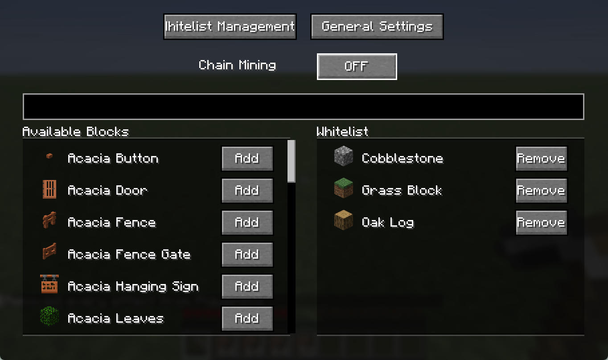
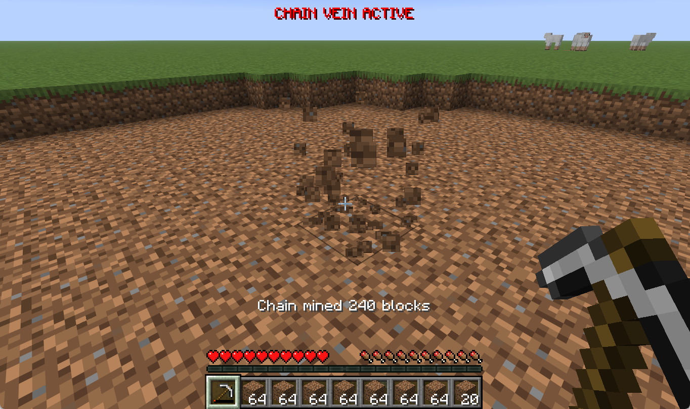
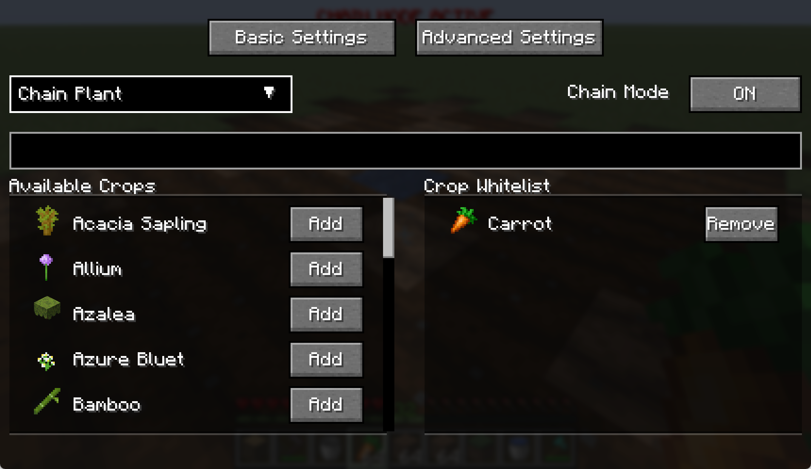
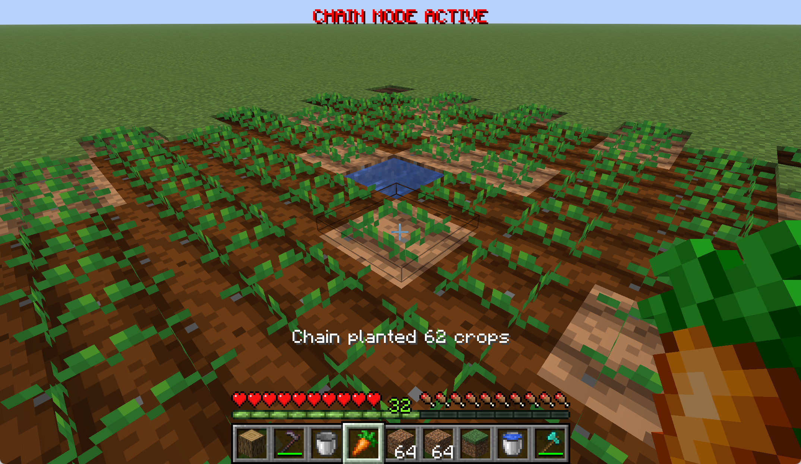
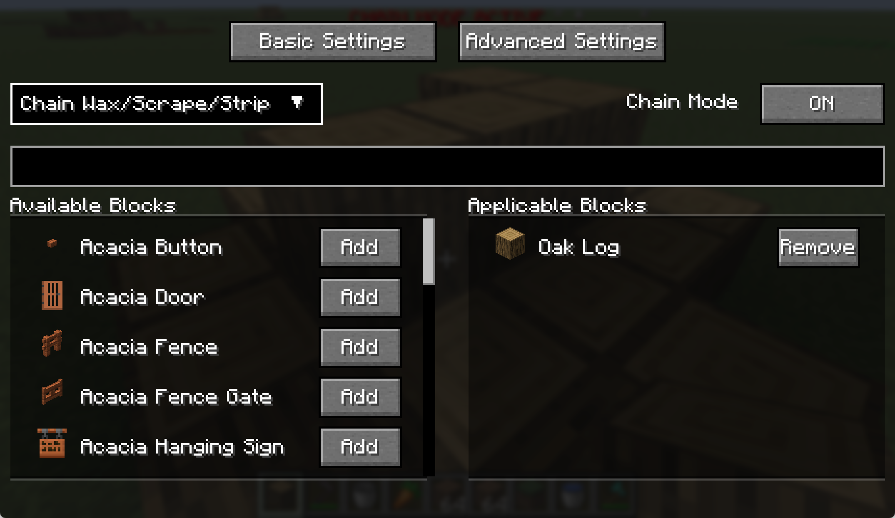
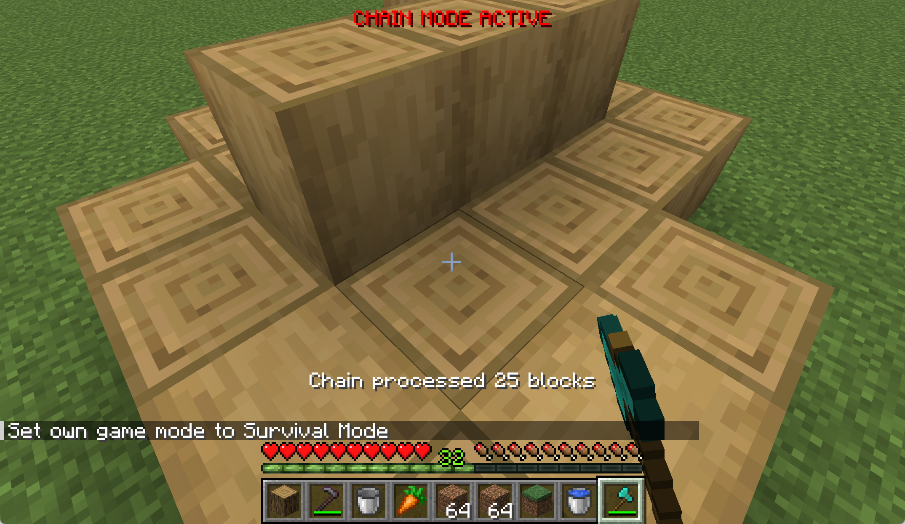

# ChainVeinFabric / 连锁采集 Fabric

A modern, efficient, and configurable Chain Mining & Interaction mod for Minecraft Fabric 1.21+.
Compatible with vanilla servers (client-side mode) and enhanced when installed on the server.

一个适用于 Minecraft Fabric 1.21+ 的现代、高效且可高度配置的连锁采集与交互模组。
兼容原版服务器（客户端模式），并在服务端安装时提供增强功能。

---

## ✨ Features / 功能特性

*   **Configurable Chain Mining**: Mine connected blocks of the same type automatically.
    *   **可配置的连锁采集**：自动采集相连的同类方块。
*   **Chain Planting**: Quickly plant seeds on compatible soil. Supports wheat, carrots, potatoes, etc.
    *   **连锁种植**：在兼容的耕地上快速补种。支持小麦、胡萝卜、马铃薯等作物。
*   **Chain Wax/Scrape/Strip**: Batch process blocks using tools or items. Supports waxing copper, scraping rust, stripping logs, and tilling soil.
    *   **连锁打蜡/除锈/去皮**：使用工具或物品批量处理方块。支持铜块打蜡、除锈、原木去皮以及耕地。
*   **Visual Configuration GUI**: Press `V` to open a user-friendly configuration screen.
    *   **可视化配置界面**：按 `V` 键打开友好的配置界面。
*   **Whitelist Management**: Per-mode whitelists for mining, crops, and utility interactions.
    *   **白名单管理**：针对采集、作物和工具交互分别提供独立的白名单。
*   **Tool Protection**: Automatically stops operations when tool durability is low (<= 10).
    *   **工具保护**：当工具耐久度低（<= 10）时自动停止操作，防止工具损坏。

---

## 📸 Screenshots / 截图

> *Description: Mining mode configuration with block whitelist.*
> *描述：连锁采集模式下的方块白名单管理界面。*

> *Description: Action Bar feedback after chain mining blocks.*
> *描述：连锁采集后的动作栏反馈信息。*

> *Description: Chain Planting configuration showing the item whitelist (seeds/crops).*
> *描述：连锁种植模式配置界面，展示种子/作物白名单。*

> *Description: Chain planting carrots in a large area with a single click.*
> *描述：一键在大范围内连锁种植胡萝卜。*

> *Description: Chain Wax/Scrape/Strip configuration showing the "Applicable Blocks" whitelist.*
> *描述：连锁打蜡/除锈/去皮模式配置界面，展示“适用方块”白名单。*

> *Description: Stripping a whole stack of logs instantly using an axe.*
> *描述：使用斧头瞬间连锁去皮整堆原木。*

---

## 🛠️ Usage / 使用说明

1.  **Open Config**: Press **`V`** to open the menu. Use the **Mode Dropdown** to switch between Mining, Planting, and Utility modes.
    *   **打开配置**：按 **`V`** 键打开菜单。使用**模式下拉框**在采集、种植和交互模式间切换。
2.  **Setup Whitelists**: 
    *   **Mining**: Add blocks like `iron_ore` or `oak_log`.
    *   **Planting**: Add items like `carrot` or `wheat_seeds`.
    *   **Utility**: Add blocks you want to interact with, like `oak_log` (for stripping) or `grass_block` (for tilling).
    *   **设置名单**：
        *   **采集**：添加如 `iron_ore` 或 `oak_log` 等方块。
        *   **种植**：添加如 `carrot` 或 `wheat_seeds` 等种子物品。
        *   **交互**：添加想要交互的方块，如 `oak_log`（去皮）或 `grass_block`（耕地）。
3.  **Perform**: 
    *   **Mine**: Break a whitelisted block.
    *   **Plant**: Right-click soil with seeds.
    *   **Interact**: Right-click with tools (Axe/Hoe) or items (Honeycomb).
    *   **执行**：
        *   **采集**：挖掘白名单方块。
        *   **种植**：手持种子右键耕地。
        *   **交互**：手持工具（斧、锄）或物品（蜜脾）右键目标方块。

---

## ⚙️ Configuration Options / 配置选项

| Option / 选项 | Description / 描述 |
| :--- | :--- |
| **Chain Mode / 模式** | Toggle between Mine (挖掘), Plant (种植), and Wax/Scrape/Strip (交互). |
| **Max Blocks / 数量上限** | Max blocks/crops per action. |
| **Tool Protection / 工具保护** | Stops if durability <= 10. (Also works for honeycomb stacks). |
| **Direct to Inv / 直接进包** | Requires Mod on Server. |

---

## 🤝 Compatibility / 兼容性机制

This mod uses a smart networking system to determine how to break blocks:
本模组使用智能网络系统来决定如何破坏方块：

1.  **Vanilla Server (No Mod Installed)**:
    *   The client performs the search (BFS) and sends standard packet requests to break blocks one by one.
    *   Items drop on the ground.
    *   **原版服务器（未安装模组）**：客户端进行计算，发送标准数据包逐个破坏方块。物品掉落在地上。

2.  **Modded Server (Mod Installed)**:
    *   The client sends a single packet with the list of blocks.
    *   The server breaks them efficiently and supports **Direct to Inventory**.
    *   **模组服务器（已安装模组）**：客户端发送包含方块列表的数据包。服务端高效破坏方块并支持**直接进入背包**。

---

## 📝 License / 许可证

This project is licensed under the GPL-3.0 License.
本项目采用 GPL-3.0 许可证。
