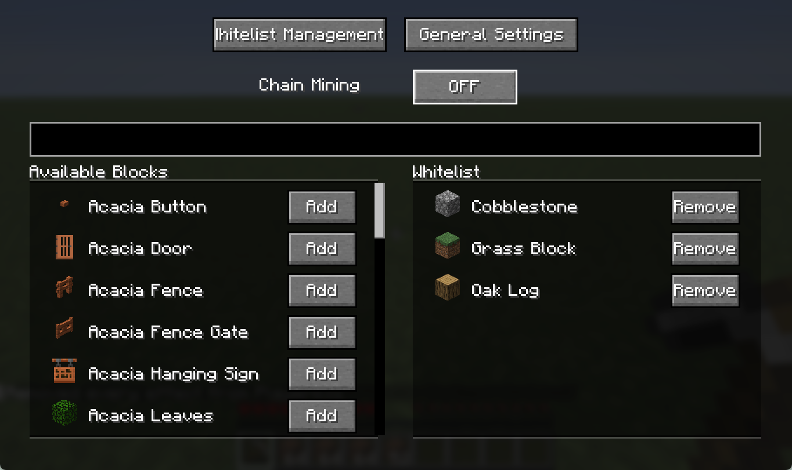
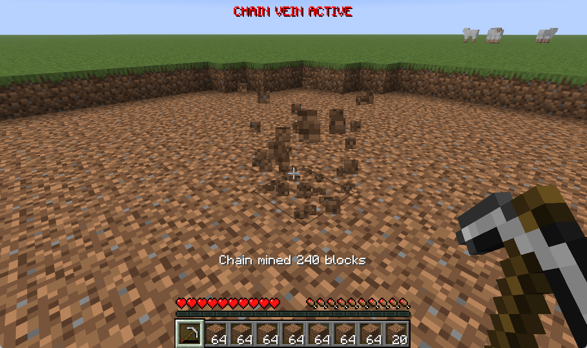
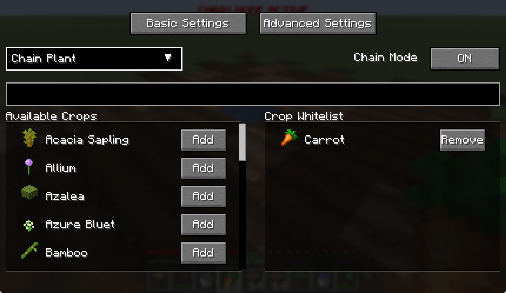
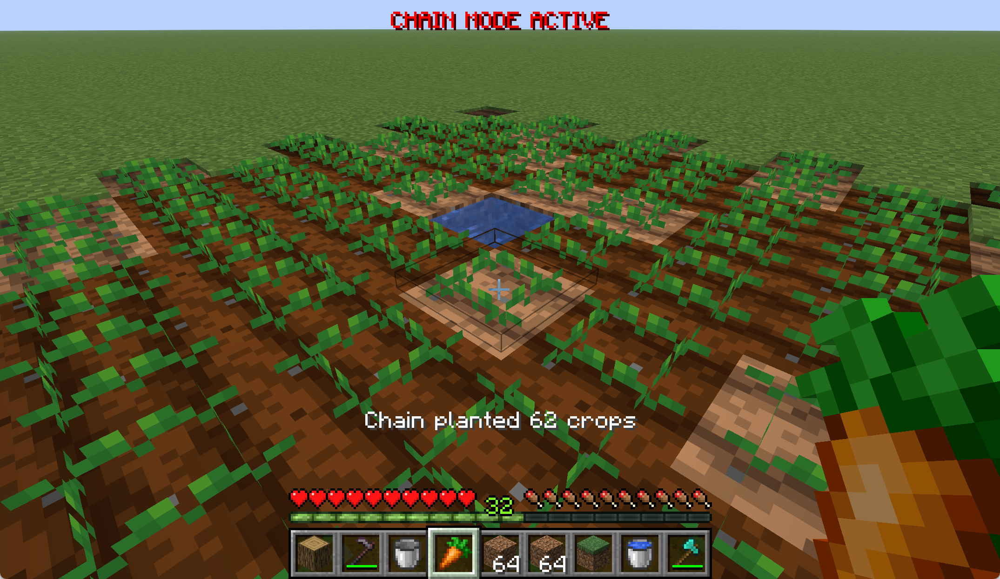
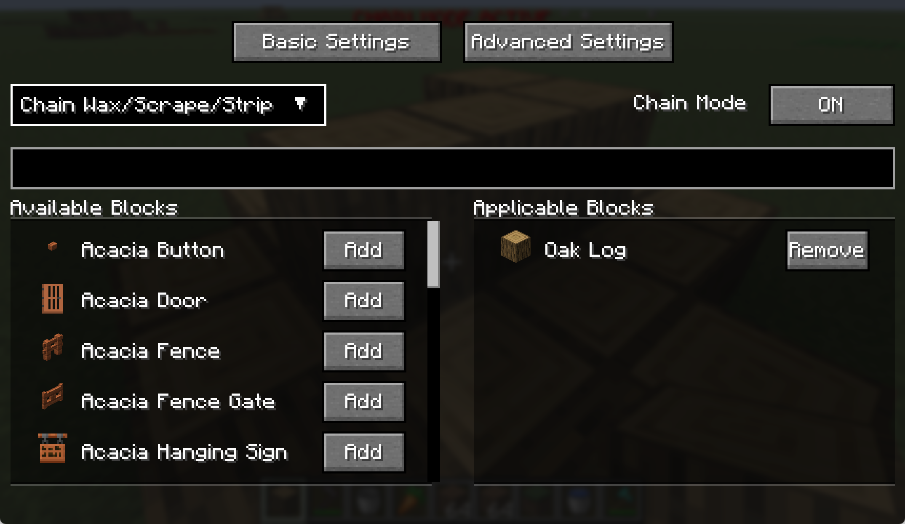
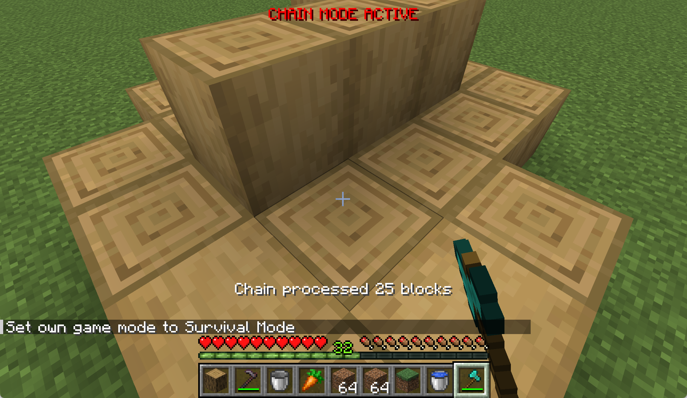

# ChainVeinFabric / 连锁采集 Fabric

[English](README.md)

一个适用于 Minecraft Fabric 的现代、高效且可高度配置的连锁采集与交互模组。
它可以仅安装在客户端并兼容原版服务器；同时安装到服务端后可获得额外能力。

> **版本支持：** ChainVeinFabric 4.x 支持 Minecraft 26.1.x 和 26.2.x 版本线。3.x 及后续版本不再支持 Minecraft 1.21.x；1.21.x 请使用 ChainVeinFabric 2.2.1。

---

## ✨ 功能特性

- **连锁采集：** 自动采集相连的同类方块或白名单方块。
- **受控自动挖掘：** 在任意挖掘模式中按住 Ctrl 点击主开关即可待命；之后每次左键以玩家为中心执行一轮搜索与挖掘，并受可配置冷却与醒目警示 HUD 限制；点击 **AUTO** 即可解除。
- **连锁种植：** 在匹配的土壤上批量种植兼容作物。种植白名单只接受可种植物品，目标白名单快捷键读取主手物品。
- **连锁交互：** 批量完成铜块打蜡、除锈、原木去皮、耕地等物品交互。
- **多种搜索算法：** 支持同类相邻、白名单相邻、球形、平面正方形和长方体搜索，并可配置棱与顶点相邻。
- **独立白名单与预设：** 每种模式拥有独立白名单；可以创建白名单预设和完整配置预设。
- **模式快捷键：** 可配置“切换到下一个可用模式”和每种模式的直达快捷键，并可选择快捷键切换后立即开启连锁。
- **统一异步搜索：** 描边预览、手动操作和自动挖掘共用同一个带优先级的搜索线程，大范围搜索不会在客户端主线程执行。
- **搜索描边：** 预览当前搜索到的方块；自动挖掘和三种 Litematica 模式分别使用不同颜色。
- **工具保护：** 动态限制连锁数量并保留 10 点耐久安全余量。
- **防踢出保护：** 可设置连接原版服务器时使用的发包间隔。
- **可选服务端支持：** 服务端安装后可高效批量处理，并支持直接进入背包。
- **可选快捷潜影盒溢出收纳：** “直接进入背包”填满玩家背包后，可继续把剩余掉落物存入随身携带的潜影盒。

### 可选 Litematica 集成

安装 Litematica 后会额外显示三种采集模式：

- **投影：选区方块：** 匹配当前 Litematica 木棍选区工具划定区域内的非空气世界方块。此模式读取的是区域选区，不是原理图放置。
- **投影：多余方块：** 匹配已启用原理图放置中预期为空气、实际却存在的世界方块。
- **投影：错误方块：** 匹配已启用原理图放置中实际方块状态与预期非空气方块状态不同的位置。

多余方块和错误方块模式可选择遵循 Litematica 当前渲染层级范围，搜索和白名单导入都会遵循该开关。未安装 Litematica 时，其专属模式和直达快捷键不会显示，循环切换模式时也会自动跳过。

三个投影模式都支持手动编辑白名单和一键导入。导入会使用当前模式范围内匹配到的方块类型覆盖当前白名单；扫描会立即处理已加载区块，跳过未加载区块且不会等待其加载。

### 可选快捷潜影盒集成

客户端和服务端都安装兼容的[快捷潜影盒分支](https://github.com/water2004/quickshulker)后，高级设置页面会显示**背包满后存入潜影盒**。该选项仅在开启**直接进入背包**时生效。

该集成适用于 Minecraft 26.1.x 与 26.2.x 构建。

ChainVein 会先将掉落物放入普通玩家背包，再按背包槽位顺序尝试随身携带的潜影盒。插入过程遵循快捷潜影盒的公开 API 规则，因此不会把潜影盒嵌套放入潜影盒。最终仍无法容纳的物品会正常掉落到世界中。该集成为可选功能，未安装快捷潜影盒时不会显示对应选项。

开启该选项需要客户端和服务端都使用 ChainVeinFabric 4.x。协议版本不匹配时不会尝试解码不兼容的数据包，而是自动退回 ChainVein 的纯客户端模式。

---

## 📸 截图


> *描述：连锁采集模式下的方块白名单管理界面。*


> *描述：连锁采集后的动作栏反馈信息。*


> *描述：连锁种植模式配置界面，展示种子/作物白名单。*


> *描述：一键在大范围内连锁种植胡萝卜。*


> *描述：连锁打蜡/除锈/去皮模式配置界面，展示“适用方块”白名单。*


> *描述：使用斧头瞬间连锁去皮整堆原木。*

---

## 🛠️ 使用说明

1. 按 **`V`** 打开配置界面。
2. 选择采集、种植或交互模式；安装 Litematica 后还会显示三个投影挖掘模式。
3. 配置当前白名单：
   - 在种植模式下，使用 `carrot`、`wheat_seeds` 等可种植物品。目标白名单快捷键会添加或移除主手中的可种植物品。
   - 在其他模式下，目标白名单快捷键会添加或移除准星指向的方块。
   - 在投影模式下，也可以从当前模式范围导入并覆盖白名单。
4. 在快捷键页面设置“下一个模式”、各模式直达、连锁开关和目标白名单快捷键。若希望切换模式时同时开启连锁，请启用**模式快捷键切换后开启连锁**。
5. 执行对应操作：
   - 破坏匹配方块以执行连锁采集。
   - 在任意挖掘模式中按住 Ctrl 点击主开关可使自动挖掘待命；之后每次左键以玩家为中心执行一轮，点击 **AUTO** 即可解除。
   - 主手持有白名单内的可种植物品，右键兼容土壤以执行连锁种植。
   - 使用对应工具或物品右键目标方块以执行连锁交互。

---

## ⚙️ 主要配置项

| 选项 | 说明 |
| :--- | :--- |
| **连锁模式** | 采集、种植、交互或三个可选 Litematica 投影挖掘模式。 |
| **搜索算法** | 同类相邻、白名单相邻、球形、平面正方形或长方体。自动挖掘待命时，同类相邻从玩家脚下方块开始，平面和长方体搜索以玩家为中心。 |
| **自动挖掘冷却** | 自动挖掘待命时，两次有效左键批次之间的等待时间。 |
| **数量上限** | 每次操作最多处理的方块或交互数量。 |
| **最大半径** | 搜索位置距离起点的最大范围。 |
| **斜边／斜角方向** | 在相邻搜索中包含通过棱或顶点相连的方块。 |
| **发包间隔** | 连接原版服务器时两个操作数据包之间的延迟。 |
| **工具保护** | 动态限制连锁数量并保留 10 点耐久。 |
| **直接进入背包** | 需要服务端安装 ChainVeinFabric，否则会禁用。 |
| **背包满后存入潜影盒** | 需要客户端和服务端都安装快捷潜影盒，将“直接进入背包”的溢出物存入随身潜影盒。 |
| **显示描边** | 显示当前搜索结果的预览。 |
| **遵循渲染层** | 仅在多余／错误方块模式可用，将匹配和导入限制到 Litematica 当前渲染范围。 |
| **模式快捷键** | 循环到下一个可用模式，或直接切换到任意可用模式。 |
| **模式快捷键切换后开启连锁** | 使用模式快捷键后立即开启连锁。 |

---

## 🤝 兼容性

### Minecraft 与依赖

- **Minecraft：** 当前 4.x 构建面向 Minecraft 26.1.x 与 26.2.x，Minecraft 1.21.x 停留在 ChainVeinFabric 2.2.1。
- **MaLiLib：** 客户端必需依赖。
- **Litematica：** 可选依赖；Minecraft 26.2 支持 `0.28.3` 及以上版本，仅三个投影模式需要。
- **快捷潜影盒：** 可选依赖；客户端和服务端都安装后，可收纳“直接进入背包”的溢出物。
- **Mod Menu：** 可选的配置入口。

### 网络兼容性

4.x 服务端专用协议与 1.x～3.x 明确分离。版本不匹配时双方不会交换 ChainVein 专用数据包，客户端会像连接未安装模组的服务器一样自动使用原版数据包回退模式。下列关系仅适用于相同 Minecraft 版本的构建：

| 客户端 | 服务端 | 行为 |
| :--- | :--- | :--- |
| 1.x～3.x | 4.x | 无法使用服务端专用协议，自动使用纯客户端模式。 |
| 4.x | 4.x | 完整支持，包括快捷潜影盒溢出收纳。 |
| 4.x | 1.x～3.x | 无法使用服务端专用协议，自动使用纯客户端模式。 |

纯客户端模式不支持**直接进入背包**或快捷潜影盒溢出收纳，并会使用**发包间隔**进行防踢出保护。此次协议变更没有修改公开的 `ChainVeinClientApi` 方法。

### 客户端与服务端行为

1. **原版服务器（未安装模组）：**
   - 客户端完成搜索并发送标准交互数据包。
   - 如果服务器拒绝过快发送的数据包，可以增大**发包间隔**。
   - 不支持**直接进入背包**。
2. **模组服务器（已安装模组）：**
   - 客户端通过 ChainVein 协议发送已经确定的坐标。
   - 服务端高效处理并支持**直接进入背包**。
   - 客户端和服务端都安装兼容的快捷潜影盒后，可将溢出物收纳进随身潜影盒。
   - 无需设置发包间隔。

### 专用服务端限制

以下持久化命令需要所有者权限等级 4，配置保存在 `config/chainveinfabric-server.json`：

- `/chainvein maxBlocks [1..2048]`：每个挖掘或交互请求最多处理的坐标数量，默认 `256`。
- `/chainvein pickupRadius [0..64]`：直接进入背包与可选快捷潜影盒溢出收纳捕获掉落物的半径，默认 `10`；设为 `0` 可关闭服务端掉落物捕获。

服务端协议挖掘不限制玩家距离，但不会为了处理请求加载新区块。连锁交互使用服务端玩家的原版方块交互距离判定，因此服务端属性及兼容服务端模组的修改会直接生效，不再额外提供 ChainVein 交互距离配置。

---

## 客户端作业 API

其他客户端 Mod 可以通过 ChainVeinFabric 自身使用的同一队列提交已经确定的坐标：

```java
ChainVeinClientApi.queueMineJobs(client, positions);
ChainVeinClientApi.queuePlantJobs(client, positions);
ChainVeinClientApi.queueUseJobs(client, positions);
```

API 会负责作业排队，读取当前的“直接进入背包”和“工具保护”设置，并自动选择服务端专用协议或原版客户端发包。“直接进入背包”仅在服务端安装 ChainVeinFabric 时生效。调用方应将 ChainVeinFabric 声明为客户端可选依赖，并只在确认模组已经加载后调用。

4.0.0 保持所有公开方法签名不变。

---

## 📝 许可证

ChainVeinFabric 使用 GPL-3.0 许可证。
